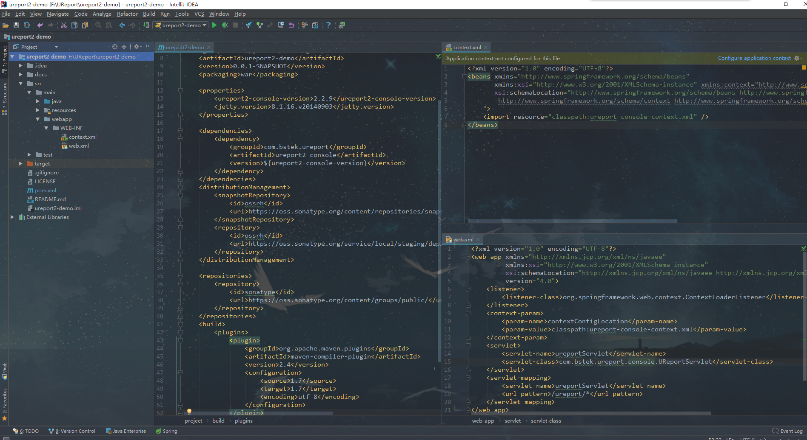
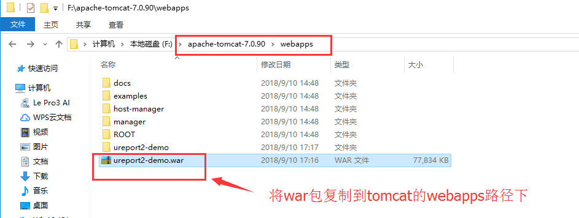
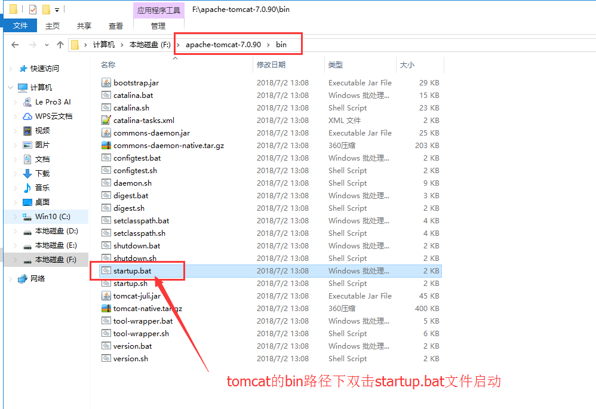
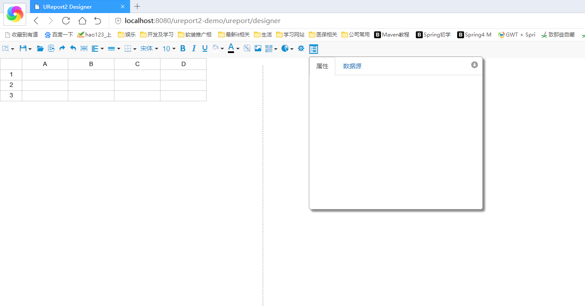

# ureport2-demo
a demo for ureport2

>UReport2是一款基于架构在Spring之上纯Java的高性能报表引擎，通过迭代单元格可以实现任意复杂的中国式报表。相比UReport1，UReport2重写了全部代码，弥补了UReport1在功能及性能上的各种不足。

>在UReport2中，提供了全新的基于网页的报表设计器，可以在Chrome、Firefox、Edge等各种主流浏览器运行（IE浏览器除外）。使用UReport2，打开浏览器即可完成各种复杂报表的设计制作。

>UReport2是第一款基于Apache-2.0开源协议的中式报表引擎，Github地址：https://github.com/youseries/ureport，欢迎大家前去fork、star。

#demo项目创建
参考教程http://wiki.bsdn.org/display/UR/ureport2+Home

#tomcat部署
>打包过程在此不讲，有兴趣或疑问请自行检索检查
>将war包命名为ureport2-demo.war并复制到tomcat的webapps路径下

>tomcat的bin路径下双击startup.up文件启动项目

>启动tomcat之后在浏览器地址栏中输入ureport的访问地址
http://localhost:8080/ureport2-demo/ureport/designer

